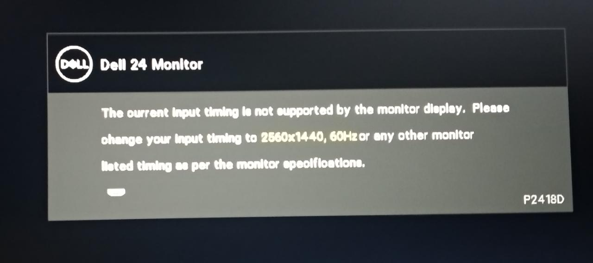

# Setup AMDGPU drivers to work with Monitor display via Xorg on Ubuntu

Recently in a fresh install of Ubuntu I've faced lots of trouble to set up a RX 570 4GB to work with a Dell 1440p (P2418D).

If you have a Nvidia GPU, you can jump to [Setting up monitor in Xorg](https://github.com/jonaslimads/amdgpu-xorg-monitor-troubleshoot#setting-up-monitor-in-xorg).

The GPU worked just fine on Windows, however on Ubuntu - or any other Linux distro, I've tested several ones - there were two main issues:

1. the boot crashed, then after 1 minute or so the GPU run really fast, stopped, then a black screen would stay forever. It couldn't even get to login screen.
    * I could boot with `nomodeset` added to `/etc/default/grub`. Well, nomodeset disables any video drivers, so not really a solution, plus monitor was showing a 1024x768 resolution.
2. after successfully updating drivers and disabling some AMDGPU settings, I could pass the boot, but the monitor would immediately show:
    > The current input timing is not supported by the monitor display. Please change your input to 2560x1440, 60Hz or any other monitor.
    
    

## Updating AMDGPU and Mesa drivers

First check whether your video card is being recognized by the system:

```sh
$ lspci -k | grep VGA
06:00.0 VGA compatible controller: Advanced Micro Devices, Inc. [AMD/ATI] Ellesmere [Radeon RX 470/480/570/570X/580/580X/590] (rev ef)

$ lspci -k | grep amdgpu 
        Kernel modules: amdgpu # means you have amdgpu installed already
        Kernel driver in use: amdgpu # means the amdgpu is running

# 'Kernel driver in use: amdgpu' won't show up in nomodeset
# or when the AMDGPU is not working 
```

As a first step make sure you have amdgpu and Mesa drivers up to date. AMDGPU proprietary software won't be needed to make the system boot and the GPU work, so you can install it later on if you want to.

1. In a fresh install, if you haven't done already, you can run software updates through your *software updates app*.
2. Run (more at https://linuxconfig.org/how-to-install-the-latest-amd-radeon-drivers-on-ubuntu-18-04-bionic-beaver-linux):
```sh
$ sudo add-apt-repository ppa:oibaf/graphics-drivers
$ sudo apt update && sudo apt -y upgrade
```
This may suffice, but in my case I had to update [initramfs](https://manpages.ubuntu.com/manpages/precise/man8/update-initramfs.8.html) to make the updates work
```sh
sudo update-initramfs -u
```

Go on and reboot. If you read something like **fb0: switching to amdgpudrmfb from EFI VGA**, reboot with nomodeset or in emergency mode, and add `amdgpu.dpm=0` to `/etc/default/grub`:
```sh
sudo vim /etc/default/grub # or sudo nano

# add amdgpu.dpm=0 to GRUB_CMDLINE_LINUX_DEFAULT
# for easier debug remove "quiet splash" from GRUB_CMDLINE_LINUX_DEFAULT

sudo update-grub
```

Then reboot. If it does not work, try adding `amdgpu.dc=0`. Again, if your monitor is all good with your GPU, you will get a login screen from now on.

## Setting up monitor in Xorg

After updating drivers and still got the boot crashing, `cat /var/log/gpu-manager.log` would show me the amdgpu was installed, so the GPU was recognized. The issue was that the GPU was not recognizing the display.

Go ahead and inspect all config in [Xorg](https://wiki.archlinux.org/index.php/Xorg) at `/usr/share/X11/xorg.conf.d`. You may notice that there is no monitor setup in any of the conf files. In mine there was even a Wacom table setup, but not monitor display whatsoever!

```ls
$ ls -l /usr/share/X11/xorg.conf.d
-rw-r--r-- 1 root root   93 jul 20 22:55 10-amdgpu.conf
-rw-r--r-- 1 root root 1350 jun 24 03:00 10-quirks.conf
-rw-r--r-- 1 root root   92 out 22  2019 10-radeon.conf
-rw-r--r-- 1 root root 1429 ago 13  2019 40-libinput.conf
-rw-r--r-- 1 root root 3458 mar 11 05:56 70-wacom.conf
```

**Make sure you backup Xorg config files before changing it.**

Your default config may be different, but the idea is the same: comment out any AMDGPU and Radeon default setup and manually setup AMDGPU + monitors.
You can check [xorg.conf.d](./xorg.conf.d) and adjust your Modeline accordingly to your monitor.

Instead of copying the whole `xorg.conf.d` folder, make sure you read your default config files and change only the monitor, screen and device (GPU) - make sure there are not duplicates of Device section of GPUs or otherwise it won't work in your xorg.conf.d

```sh
sudo cp -R /usr/share/X11/xorg.conf.d /usr/share/X11/backup-xorgs # IMPORTANT

sudo mv /usr/share/X11/xorg.conf.d/10-amdgpu.conf /usr/share/X11/xorg.conf.d/10-amdgpu.conf.old
sudo mv /usr/share/X11/xorg.conf.d/10-radeon.conf /usr/share/X11/xorg.conf.d/10-radeon.conf.old

sudo vim /usr/share/X11/xorg.conf.d/50-amdgpu.conf
```

According to https://wiki.archlinux.org/index.php/Xorg#Using_.conf_files, 
> the files are read in ASCII order, and by convention their names start with `_XX_-`

so make sure your monitor conf is one the last files, i.e named as `50-amdgpu.conf`


See [50-amdgpu.conf](./xorg.conf.d/50-amdgpu.conf) for a whole working setup. It is based on https://wiki.archlinux.org/index.php/Xorg#Manual_configuration, however I've had to manual set GPU BusID.

Your GPU's PCI bus id can be found through
```sh
$ lspci | grep VGA
06:00.0 VGA compatible controller: Advanced Micro Devices, Inc. [AMD/ATI] ....
# BusID is then "PCI:6:0:0" 
```

Depending on your monitor you will need a Modeline with different resolution and frequency. Go ahead and check [cvt command](https://linux.die.net/man/1/cvt).

```sh
$ cvt 2560 1440 60                              
# 2560x1440 59.96 Hz (CVT 3.69M9) hsync: 89.52 kHz; pclk: 312.25 MHz
Modeline "2560x1440_60.00"  312.25  2560 2752 3024 3488  1440 1443 1448 1493 -hsync +vsync

# or

$ cvt 1920 1080 60
# 1920x1080 59.96 Hz (CVT 2.07M9) hsync: 67.16 kHz; pclk: 173.00 MHz
Modeline "1920x1080_60.00"  173.00  1920 2048 2248 2576  1080 1083 1088 1120 -hsync +vsync
```
The important part is `Modeline ...` line, which will be entirely copied to Section Monitor as you can see in  [50-amdgpu.conf](./xorg.conf.d/50-amdgpu.conf). Change also "2560x1440_60.00" in PrefferedMode and Modes line to your monitor spec.

If 60Hz does not work, try running **cvt** with 55Hz i.e `cvt 1920 1080 55`

After that your display is manually linked with GPU! Go ahead and try boot again. If it's all good, your resolution will be set back and several resolutions will be available:
```
$ xrandr
Screen 0: minimum 320 x 200, current 2560 x 1440, maximum 16384 x 16384
DisplayPort-0 disconnected (normal left inverted right x axis y axis)
DisplayPort-1 disconnected (normal left inverted right x axis y axis)
DisplayPort-2 disconnected (normal left inverted right x axis y axis)
HDMI-A-0 connected primary 2560x1440+0+0 (normal left inverted right x axis y axis) 526mm x 296mm
   2560x1440     59.95*+
   1920x1200     59.95  
   2048x1080     60.00    24.00  
   1920x1080     60.00    50.00    59.94    24.00    23.98  
   1600x1200     60.00  
   1680x1050     59.88 
...

# both 'in use' and 'modules' will show up:
$ lspci -k | grep amdgpu
        Kernel driver in use: amdgpu
        Kernel modules: amdgpu
```

## Multi-monitor setup

Even though I have not tested, Xorg supports many sections of "Monitor", "Screen" and "Devices", you can even set up two GPUs. The idea is to **have unique identifies for monitor/screen, and reuse GPU "Device" identifier in two or more Section "Screen"**.

## Post improvements

Feel free to keep tweaking GPU's config in Xorg for better performance. As you could see in https://linuxconfig.org/how-to-install-the-latest-amd-radeon-drivers-on-ubuntu-18-04-bionic-beaver-linux, you can setup DRI3, AccelMethod and so on. Check your driver docs for full coverage.
